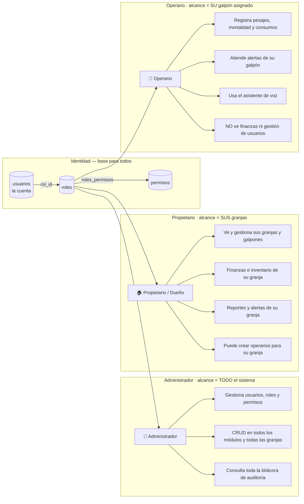

# AVISENS — Diagrama de Roles y Permisos

Muestra los roles del sistema, **qué puede hacer cada uno** y **hasta dónde llega
su alcance**. Todos los roles son `usuarios` (la misma tabla); lo que cambia es su
`rol_id` y los `permisos` asociados.

---

## Diagrama de roles (Mermaid)

---

## Cómo se limita el alcance (¡esto es lo importante!)

| Rol | Alcance | Se controla con la tabla… |
|---|---|---|
| **Administrador** | Todo el sistema | sus `permisos` (todos) |
| **Propietario / Dueño** | Solo *sus* granjas | `granjas.propietario_id → usuarios.id` |
| **Operario** | Solo *su* galpón asignado | `usuarios_galpones` |

> El **dueño** no es un módulo ni una tabla nueva: es un `usuario` con
> `rol = Propietario`, dueño de una granja vía `granjas.propietario_id`.

---

## Matriz de permisos por módulo

✅ Gestiona (crear/editar) · 👁️ Solo consulta · ❌ Sin acceso

| Módulo / acción | 👑 Admin | 🏠 Propietario | 🔧 Operario |
|---|:---:|:---:|:---:|
| Usuarios y roles | ✅ global | ✅ su granja | ❌ |
| Permisos / configuración | ✅ | ❌ | ❌ |
| Granjas y galpones | ✅ global | ✅ las suyas | 👁️ el asignado |
| Monitoreo (sensores/mediciones) | ✅ | 👁️ su granja | 👁️ su galpón |
| Umbrales ambientales | ✅ | ✅ su granja | 👁️ |
| Alertas | ✅ | ✅ su granja | ✅ su galpón |
| Bitácora productiva (lotes, pesajes…) | ✅ | ✅ su granja | ✅ registrar su galpón |
| Finanzas | ✅ | ✅ su granja | ❌ |
| Inventario | ✅ | ✅ su granja | ✅ registrar consumo |
| Infraestructura / mantenimiento | ✅ | ✅ su granja | 👁️ reportar falla |
| CRM / Chatbot (prospectos) | ✅ | ❌ | ❌ |
| Asistente de voz | ✅ | ✅ | ✅ (su herramienta) |
| Auditoría (`bitacora_auditoria`) | ✅ ver todo | 👁️ su granja | ❌ |

---

## Cómo se traduce a las tablas del módulo Admin

1. Cada fila de esta matriz es un **`permiso`** (ej. `finanzas.editar`, `lotes.crear`).
2. Cada rol se enlaza con sus permisos en **`roles_permisos`** (N:M).
3. El sistema, al hacer login, lee `usuarios.rol_id → roles → roles_permisos → permisos`
   y así sabe qué mostrar y qué bloquear.

> Así, si mañana quieres un rol nuevo (ej. **Asesor** para el chatbot, que solo ve
> `prospectos` y `cotizaciones`), **no tocas código**: creas el rol y le marcas
> sus permisos. Esa es la ventaja de tener `permisos` + `roles_permisos`.
