# AVISENS — Flujo completo y manejo de tablas

Este documento muestra el recorrido de los actores del sistema y **qué tablas se
usan en cada paso** (INSERT = crear, SELECT = consultar, UPDATE = actualizar).
Sirve para explicar cómo se relacionan los módulos y sus tablas.

---

## Actores

| Actor | ¿Tiene cuenta? | ¿Qué es? |
|---|---|---|
| **Visitante** | No | Anónimo navegando la landing |
| **Prospecto** | No | Visitante que usó el chatbot → es un *lead* (tabla `prospectos`) |
| **Usuario** | Sí | Tiene login y opera el sistema según su `rol` |
| **Administrador** | Sí | Usuario con rol que gestiona usuarios, roles y permisos |

> Clave: el de la landing **NO** es un `usuario`. Solo se vuelve `usuario`
> cuando el admin le crea una cuenta.

---

## Diagrama de flujo (Mermaid)

```mermaid
flowchart TD
    A([Visitante anónimo<br/>entra a la landing]) --> B{¿Usa el chatbot<br/>de cotización?}
    B -- No --> Z([Sale / solo navega<br/>— no toca tablas])
    B -- Sí --> C[Captación · EP-01]

    subgraph EP01 [EP-01 · Chatbot de cotización]
        C --> C1[(prospectos<br/>INSERT)]
        C1 --> C2[(respuestas_chatbot<br/>INSERT por respuesta)]
        C2 --> C3[(interacciones_chatbot<br/>INSERT por mensaje)]
        C3 --> C4[(cotizaciones +<br/>cotizaciones_sensores<br/>INSERT)]
    end

    C4 --> D{¿Cierra la venta?}
    D -- No --> Z2([Queda como lead<br/>prospectos.estado = 'perdido'])
    D -- Sí --> E[Alta de cuenta · MÓDULO ADMIN]

    subgraph ADMIN [Módulo Admin]
        E --> E1[(usuarios<br/>INSERT — rol_id, datos)]
        E1 --> E2[(seguridad_cuenta<br/>INSERT 1:1)]
        E2 --> E3[(usuarios_galpones<br/>INSERT — asigna galpones)]
        E3 --> E4[(bitacora_auditoria<br/>INSERT — registra el alta)]
    end

    E4 --> F[Login · MÓDULO USUARIO]

    subgraph USR [Módulo Usuario]
        F --> F1[(usuarios<br/>SELECT por email)]
        F1 --> F2{¿password_hash<br/>correcto?}
        F2 -- No --> F3[(seguridad_cuenta<br/>UPDATE intentos_fallidos<br/>/ bloqueado_hasta)]
        F2 -- Sí --> F4{¿rol.requiere_mfa?}
        F4 -- Sí --> F5[Verifica MFA / pin_voz]
        F4 -- No --> F6
        F5 --> F6[(sesiones<br/>INSERT refresh token)]
        F6 --> F7[(seguridad_cuenta<br/>UPDATE fecha_ultimo_login)]
    end

    F7 --> G[Autorización]

    subgraph AUTH [Control de acceso]
        G --> G1[(roles<br/>SELECT del usuario)]
        G1 --> G2[(roles_permisos<br/>SELECT)]
        G2 --> G3[(permisos<br/>SELECT — qué puede hacer)]
    end

    G3 --> H{¿Qué rol tiene?}
    H -- Administrador --> I[Opera TODO + gestión de usuarios]
    H -- Operario --> J[Opera su galpón asignado]
    H -- Propietario --> K[Consulta su granja]

    I --> OP[Operación en módulos]
    J --> OP
    K --> OP

    subgraph MODULOS [Módulos operativos — según permisos]
        OP --> M1[(EP-04 Monitoreo<br/>granjas, galpones, sensores, mediciones)]
        OP --> M2[(EP-06 Bitácora<br/>lotes, pesajes, mortalidad, consumos)]
        OP --> M3[(EP-05 Alertas<br/>alertas, evidencias)]
        OP --> M4[(EP-07 Finanzas/Inventario<br/>movimientos, inventario)]
        OP --> M5[(EP-08 Infraestructura<br/>equipos, mantenimientos)]
    end

    OP --> V[EP-02 · Comando de voz]

    subgraph VOZ [EP-02 · Asistente de voz]
        V --> V0[(usuarios<br/>SELECT — valida voz<br/>pin_voz_hash / huella_voz)]
        V0 --> V1{¿Hay conexión?}
        V1 -- Online --> V2[(comandos_voz<br/>INSERT modo='online')]
        V1 -- Offline --> V3[(comandos_voz<br/>INSERT sincronizado=false)]
        V2 --> V4{¿confianza_nlu alta?}
        V3 --> V4
        V4 -- No --> V5[requiere_clarificacion=true<br/>el asistente repregunta]
        V4 -- Sí --> V6[Ejecuta accion_ejecutada<br/>sobre EP-04 / EP-05 / EP-06]
        V3 -. al reconectar .-> V7[(comandos_voz<br/>UPDATE sincronizado=true)]
    end

    M1 --> L[(bitacora_auditoria<br/>INSERT — toda acción queda registrada)]
    M2 --> L
    M3 --> L
    M4 --> L
    M5 --> L
    V6 --> L

    %% Flujo recuperar contraseña
    F1 -. ¿Olvidó contraseña? .-> R1[(recuperaciones_password<br/>INSERT token)]
    R1 --> R2[(usuarios<br/>UPDATE password_hash)]
```

---

## Detalle por etapas — cómo se manejan las tablas

### Etapa 0 · Visitante (landing)
- **No toca ninguna tabla.** Solo contenido estático. Rutas públicas.

### Etapa 1 · Captación — EP-01 Chatbot *(el visitante se vuelve prospecto)*
| Tabla | Operación |
|---|---|
| `prospectos` | **INSERT** — sesión, datos de contacto, `consentimiento_habeas_data` |
| `respuestas_chatbot` | **INSERT** — una fila por respuesta (con su puntaje) |
| `interacciones_chatbot` | **INSERT** — una fila por mensaje del chat |
| `cotizaciones` + `cotizaciones_sensores` | **INSERT** — la cotización generada |

`prospectos.puntaje_total` **no se guarda**: se calcula sumando `respuestas_chatbot`.

### Etapa 2 · Alta de cuenta — Módulo Admin *(prospecto → usuario)*
| Tabla | Operación |
|---|---|
| `usuarios` | **INSERT** — datos + `rol_id` + `activo = true` |
| `seguridad_cuenta` | **INSERT** — fila 1:1 con el usuario (contadores en 0) |
| `usuarios_galpones` | **INSERT** — asigna a qué galpón(es) trabaja |
| `bitacora_auditoria` | **INSERT** — "el admin X creó al usuario Y" |

### Etapa 3 · Login — Módulo Usuario
| Tabla | Operación |
|---|---|
| `usuarios` | **SELECT** por `email`, verifica `password_hash` |
| `seguridad_cuenta` | **UPDATE** — si falla: `intentos_fallidos++`, `bloqueado_hasta`; si entra: `fecha_ultimo_login` |
| `sesiones` | **INSERT** — guarda el refresh token (JWT) |
| `recuperaciones_password` | **INSERT** (si pidió "olvidé contraseña") → luego **UPDATE** `usuarios.password_hash` |

### Etapa 4 · Autorización — qué puede hacer
| Tabla | Operación |
|---|---|
| `roles` | **SELECT** — el rol del usuario |
| `roles_permisos` | **SELECT** — los permisos de ese rol |
| `permisos` | **SELECT** — códigos como `usuarios.crear`, `alertas.cerrar` |

→ Con esto el sistema decide qué módulos y botones ve cada quién.

### Etapa 5 · Operación — módulos según permisos
El usuario trabaja en los módulos operativos (EP-04 a EP-08). **Cada acción
relevante** (crear lote, cerrar alerta, registrar gasto…) escribe una fila en
`bitacora_auditoria` → así queda el rastro de "quién hizo qué".

### Etapa 6 · Comandos de voz — EP-02 *(operario en el galpón)*
Un usuario autenticado (normalmente Operario) usa el asistente de voz dentro del
galpón, con o sin internet — útil cuando tiene las manos ocupadas.

| Tabla | Operación |
|---|---|
| `usuarios` | **SELECT** — valida identidad por voz (`pin_voz_hash` / `huella_voz_url`) |
| `comandos_voz` | **INSERT** — `comando_texto`, `confianza_nlu`, `modo_conexion`, `galpon_id` |
| `comandos_voz` | **UPDATE** `sincronizado = true` al reconectar (modo offline) |
| EP-04 / EP-05 / EP-06 | el `accion_ejecutada` dispara la operación real (ej. *"registra 3 muertes"* → **INSERT** en `registros_mortalidad`) |
| `bitacora_auditoria` | **INSERT** — queda el rastro del comando |

**Dos detalles del módulo de voz:**
- Si `confianza_nlu` es baja → `requiere_clarificacion = true` y el asistente **repregunta**.
- En **modo offline** el comando se guarda con `sincronizado = false` y se
  sincroniza con el servidor cuando vuelve la conexión.

---

## Resumen de los dos módulos que estamos presentando

| Módulo | Tablas | Para qué |
|---|---|---|
| **Usuario** | `usuarios`, `seguridad_cuenta`, `sesiones`, `recuperaciones_password` | Identidad + acceso (login, seguridad, recuperación) |
| **Admin** | `roles`, `permisos`, `roles_permisos`, `usuarios_galpones`, `bitacora_auditoria` | Gestión de quién existe, qué puede hacer y registro de actividad |
